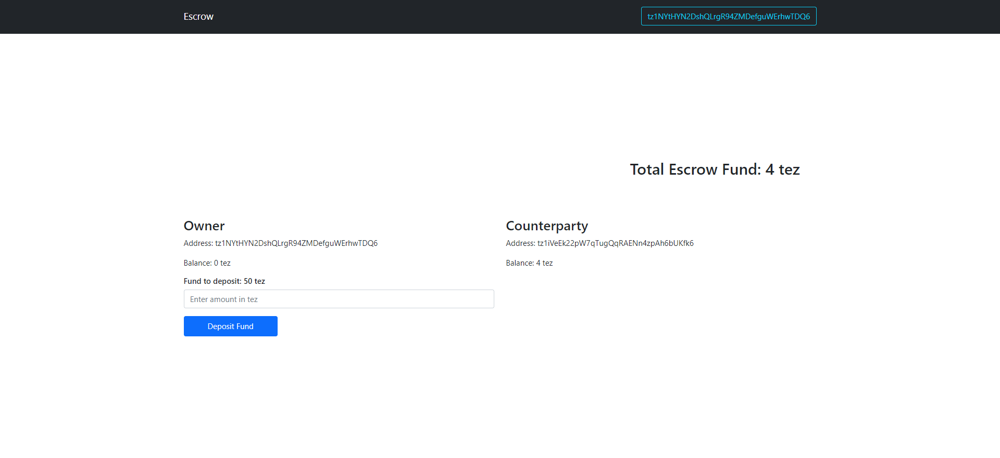
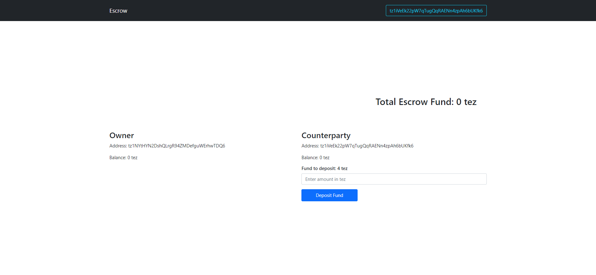
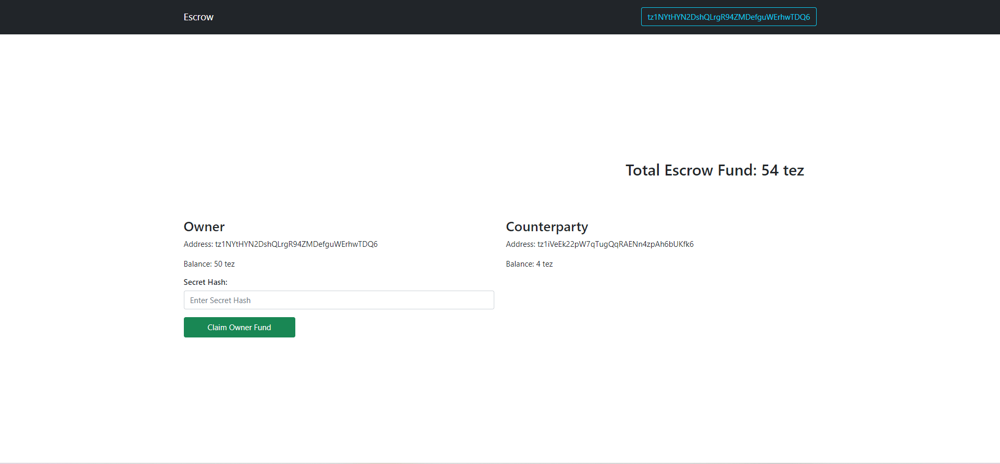
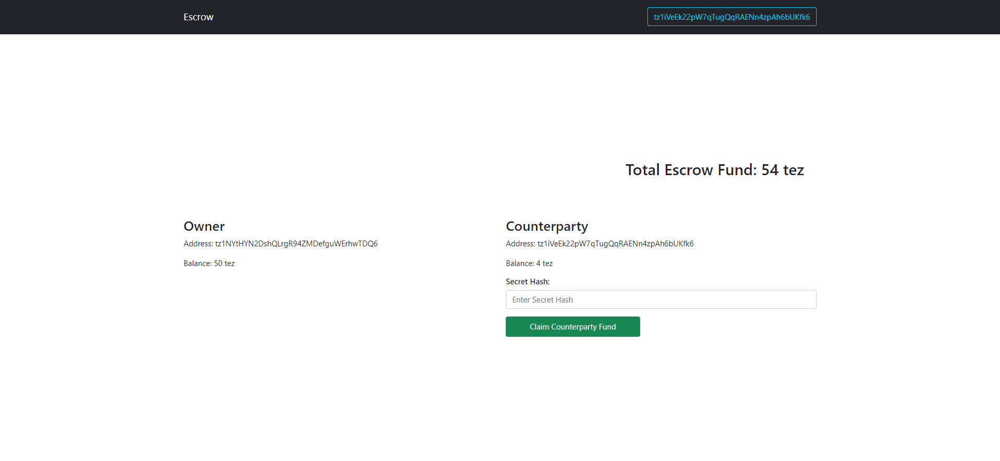
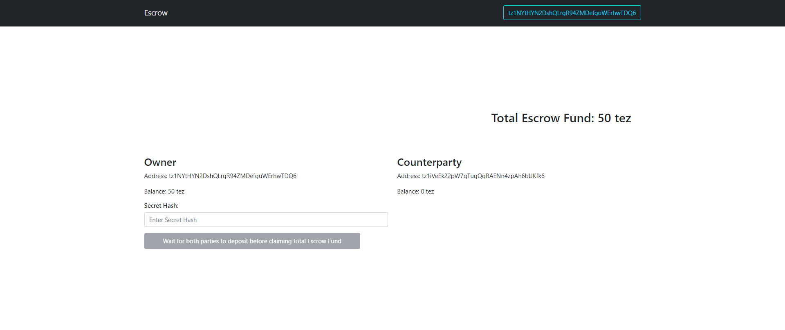
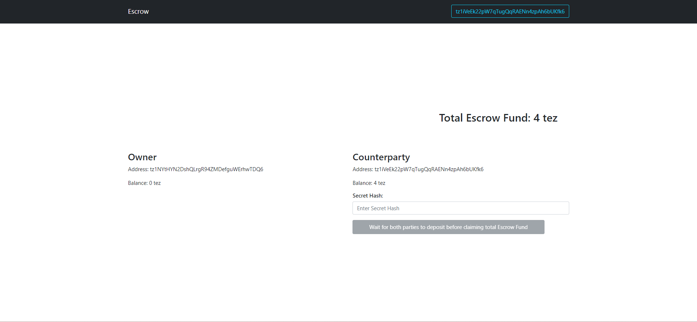
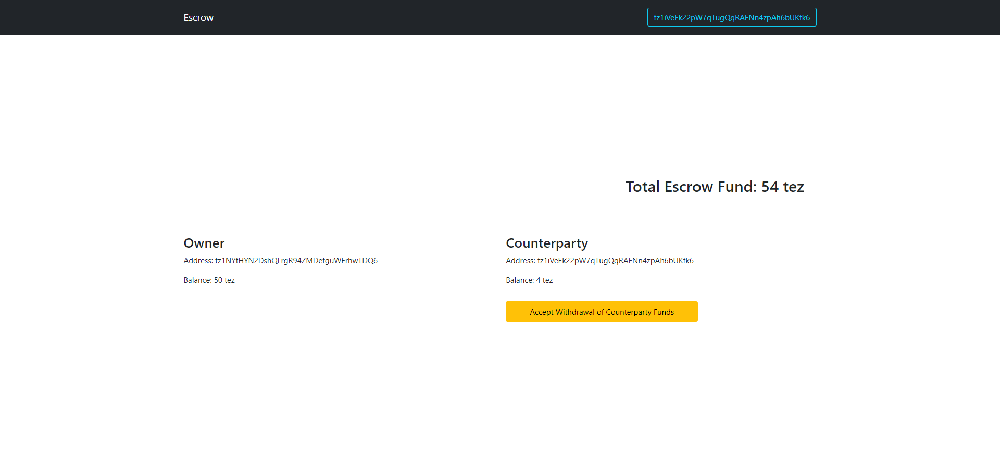

# Mini Project 2 - Tezos Taquito Integration with Escrow Contract
by Aira Mae Aloveros

The Escrow contract is a simple contract that allows two parties (owner and counterparty) to deposit funds into an escrow account. The funds can only be claimed by the owner or counterparty after a specified epoch time and only if the correct hashed secret is provided. The contract also ensures that each party can only deposit funds once.

> The Escow.py was modified to apply all milestone requirements

> Check Milestone 5 for project screenshots.

# Project Milestones:
## ✅ Milestone 1:
☑️ Set up the development environment, install dependencies, and deploy the Escrow contract using SmartPy. Verify that the contract has been deployed successfully by reading the contract storage.

#### ☑️ Addresses of the deployed contracts
a. [Can Claim Owner] 
KT1G9kRyz5jUNXksfRkRVmw7UjkSWhQgeQtx

b. [Can Claim Counterparty. Will expire at April 28, 2030 due to set timestamp value] 
KT1McssP2KyxZttN8UPGGfH5VNeQgrpNK7EG

#### ☑️ Read Contract Storage at 

a. [Claim Owner] https://api.ghostnet.tzkt.io/v1/contracts/KT1G9kRyz5jUNXksfRkRVmw7UjkSWhQgeQtx/storage

b. [Claim Counter Party] https://api.ghostnet.tzkt.io/v1/contracts/KT1McssP2KyxZttN8UPGGfH5VNeQgrpNK7EG/storage

#### Check the operations here: 
a. [Testing Claim Owner]

https://better-call.dev/ghostnet/KT1G9kRyz5jUNXksfRkRVmw7UjkSWhQgeQtx/operations

b. [Testing Claim Counterparty. WIll expire at April 28, 2030 due to set timestamp value] 

https://better-call.dev/ghostnet/KT1McssP2KyxZttN8UPGGfH5VNeQgrpNK7EG/operations

## ✅ Milestone 2:
Use Taquito.js to create a UI for the Escrow contract, including a form for depositing funds into the escrow account and a button for claiming funds. Test the UI by depositing funds from both parties into the escrow account.

☑️  form for depositing funds into the escrow account

☑️  button for claiming funds

☑️  test by depositing funds from both parties into the escrow account

## ✅ Milestone 3:
Implement the functionality for claiming funds by both parties. This involves creating functions in Taquito.js that call the appropriate entry points in the Escrow contract and passing the correct parameters.

☑️ Implement the functionality for claiming funds by both parties

## ✅ Milestone 4:
Implement the ability for the admin to revert funds from the contract in case both parties accept to withdraw the escrow. This involves adding a new entry point to the Escrow contract that can only be called by the admin, and modifying the existing entry points to include a check for whether the admin has authorized the withdrawal. In the frontend application, create a new button and form that allows the admin to initiate the fund reversion process. This should involve sending a transaction to the Escrow contract with the appropriate parameters. Once the admin has authorized the withdrawal, the funds should be returned to their respective parties. This milestone requires a deeper understanding of the Escrow contract and may be more challenging than the previous milestones. It is important to thoroughly test the contract and frontend application to ensure that everything is working correctly.

☑️ Implement the ability for the admin to revert funds

☑️ adding a new entry point to the Escrow contract that can only be called by the admin

☑️ modifying the existing entry points to include a check for whether the admin has authorized the withdrawal

☑️ create a new button and form that allows the admin to initiate the fund reversion process

## ✅ Milestone 5:
Implement additional features, such as error handling, confirmation messages, and UI improvements. Test the final application thoroughly to ensure that it works as expected.

☑️ Implement additional features

☑️ UI Improvements 

### Improvements and additional features
- When the **owner** deposits money, it will be added to **counterparty**'s balance for safe keeping and vice versa.The owner can only claim the total Escrow fund before the specified epoch time, and only the counterparty can claim the funds after the said period.

- Only authorised people can see the buttons and functionalities for their respective accounts
    1. When wallet is connected, only the set **admin** in the contract  can see the `Allow Revert Funds`, and `Revert Funds` buttons 

        
        
        

    2. When wallet is connected, only the set **owner** and **counterparty** in the contract can see their respective `Deposit Funds`, `Claim Total Fund` and `Allow Revert Funds` functionalities

        | Owner | Counterparty |
        |:-----:|:------------:|
        |||
        |||
        |||
        |||
        |||

    
- Added Total Escrow Balance to keep track of the amount.
- Added front-end restriction to only let admin allow reverting funds when both parties has deposited funds 

    
- Added front-end restriction so that only Owner and Counterparty can add balance to their own accounts 
- Added front-end restriction to only allow claiming of funds when both parties has deposited

    
